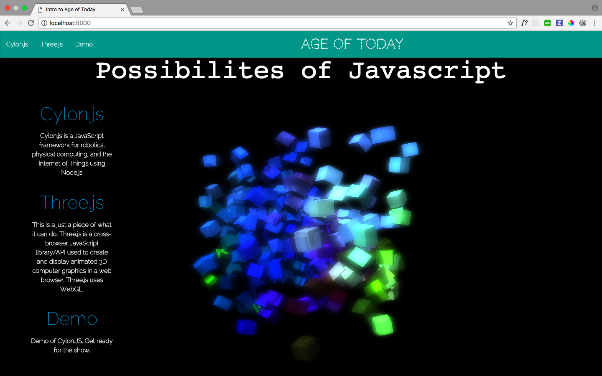

#  Age of Today App


## Synopsis:
The motivation behind this project was to showcase the technology of tomorrow and point out that it
 is really the technology of today. In this project, I tapped into the Internet of Things and discover my
 limitation of programming devices was no longer a limitation. Please welcome to the stage Javascript Robotics. 
 Of course, ideally I still want to learn C++ and C but for now, I get to practice programming devices with plain old javascript. 




## Setup:
### Mac OX Instructions for using Cylon.JS
open up terminal
cd into file folder

npm install cylon cylon-mip
npm install cylon cylon-ble

Note: You may need to install cylon-ble using the -g option, and then run 
each commands under sudo like this:

sudo cylon-ble-scan

You should something like below for the results

Peripheral discovered!
  Name: 2B-785E
  UUID: cc360e85785e
  rssi: -80

 ### Instructions for running Three.js

To run spashpage locally,

open up terminal
cd into splashpage folder
then enter into terminal:
  python -m SimpleHTTPServer


## Code Example
```Cylon.JS/Javascript
  birth: function() {
      this.age += 1;

      let batterylvl = this.level();

        if (this.age < 10){
        console.log(`Happy Birthday to You, ${this.name}.`)
        console.log(`You are ${this.age}.`);
          this.alive = true;
          this.dance();
       }else{
        this.death();
      }

       if(this.alive){
        console.log(`Happy Birthday to You, ${this.name}.`)
        console.log(`You are ${this.age}.`);
        }
     }
  ```

## Build Strategy
Originally I wanted to experiment with Robotics. When I heard about Javascript Robotics, I was totally invested in trying it out.
Before I did, I researched the contenders in the market. I discovered Johnny Five and Cylon.js. I picked Cylon.js over Johnny Five 
because I like underdogs.  Honestly, the main reason is that it advertises the idea of interconnectivity between several similar 
and dissimilar devices. My first step was to get a device to test Cylon.JS.  I choose WowWeeMIP because I thought it could pull off
a great 360 turn with its wheels. Due to mailing mishap, Amazon had send a replacement MIP which meant less time to experiment with Cylon.JS
but more time to experiement with three.js. This is how the splashpage came into existence with three.js. Prior to working with three.js, I had read
different documentations about 3d scenes and understand some concepts from Unity-Game Engine. While I waited on a package, I experimented 
with three.js online editor and read three.js documentation. 

Upon delivery, Cylon.js had my full attention, I started small with just focusiing on connectivity and console.log that I had a connection.
After that, the sky was the limit. 


## Technologies

For this project, I used the following technologies:

* Cylon.JS
* Vanilla Javascript
* Bluetooth
* Robotics: MIP and Leapmotion
* GitHub

-SplashPage Intro to Cylon: 
* three.js
* Materialize
* HTML
* CSS


## Future Improvements (not in any particular order)

1. Add a Chrome Extension App for MIP robots using Chrome Bluetooth API
2. Make a client-side interface through Meteor and React
3. Group more devices and coordinate a 'Thriller Dance' or 'Purple Rain'
4. Endless ideas. There are robots.


## Contributing
* Stack Overflow 
* W3 Schools
* Cylon.JS Documentation
* Node.js Documentation
* Three.js Documentation 
* three.js online Editor
* three.js github Repo
* Leapmotion Developer Documentation

These resources really helped. 

##Authors
Shantel Moore
